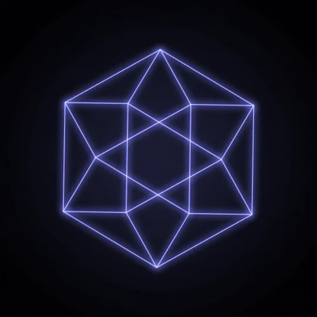
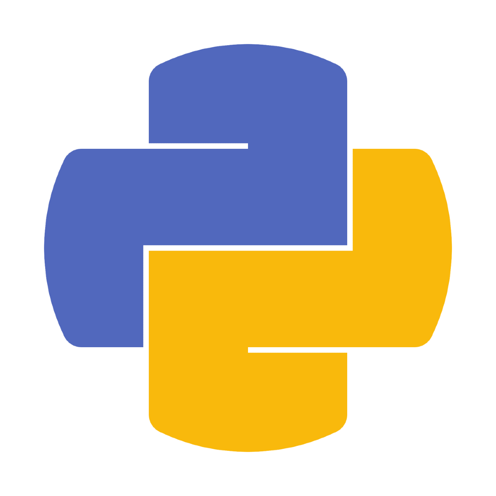
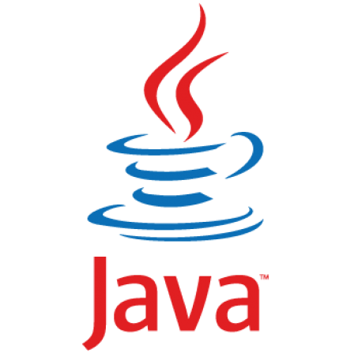
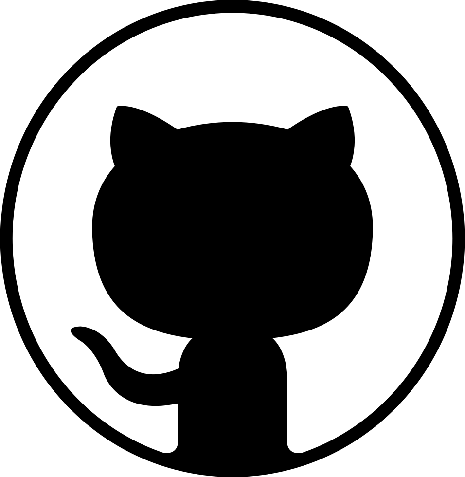

### Hi there, I'm [Nassos Anagnostopoulos][website]👋

<!--  -->
<!--  -->

## About Me 👨‍🎓

- 🎓 Bachelor's Degree in CS at the department of Informatics & Telecommunications at [UoA].
- 💻 Currently working as a Junior Data Engineer at [Netcompany-Intrasoft].
- 🤖 Deeply passionate about Data Engineering, Data Science, Machine Learning, and AI.
- 🥅 2023 Goal: Contribute more to Open Source projects.
- ✈️ I really enjoy traveling, camping and exploring places on my spare time.
- 🏀 I play basketball almost daily since I was a kid and I love watching the NBA.
<!-- - ⚡ Fun fact: I love to draw and play guitar / drums -->

<!-- 

 -->

### Programming Languages 💻:

<!--  -->

<!--  -->
<!--  -->
<!--  -->

 

### Big Data Technologies 💾:

<!-- 

 -->
 

### Database Systems:
 

 

### Tools 🛠️:

 

### Connect with me 🔗:

[][website]
[][twitter]
[][linkedin]
 

---

   
  

[UoA]: https://www.di.uoa.gr/
[Netcompany-Intrasoft]: https://www.netcompany-intrasoft.com
[website]: https://nassosanagn.github.io/
[twitter]: https://twitter.com/nassosanagn
[linkedin]: https://www.linkedin.com/in/nassosanagn/
